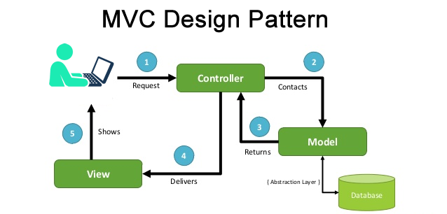
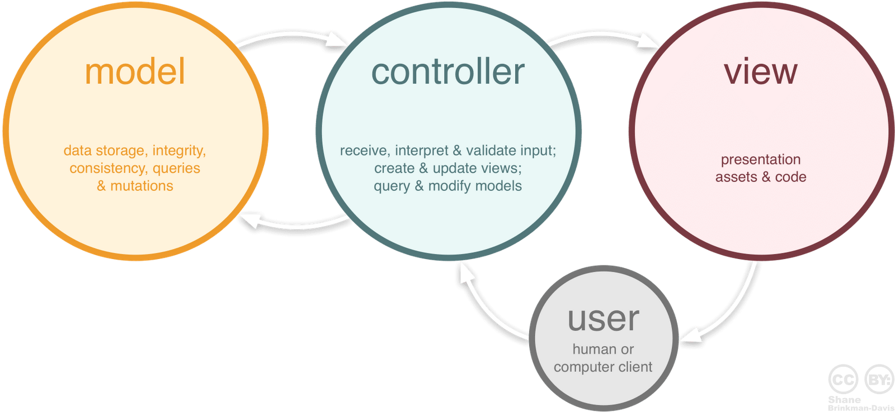

# Отчет по лабораторной работе №1
## Содержание:
1. [Архитектура MVC](#архитектура-mvc)
2. [Анализ кода](#анализ-кода)
3. [Заключение](#заключение)


# Архитектура MVC
Шаблон MVC (Model-View-Controller) — это архитектурный паттерн, который разделяет приложение на три логических компонента: Модель (Model), Представление (View) и Контроллер (Controller). Этот паттерн используется для разделения бизнес-логики, пользовательского интерфейса и ввода пользователя, что позволяет упрощать разработку, поддержку и тестирование приложений.


### 1. **Model (Модель)**

Модель отвечает за бизнес-логику приложения и данные. Она управляет информацией, которую приложение использует и обрабатывает. Например, она взаимодействует с базой данных, выполняет вычисления, обрабатывает состояния и представляет данные в нужном виде.

**Пример:**

```java
public class User {
    private String name;
    private int age;

    // Конструктор
    public User(String name, int age) {
        this.name = name;
        this.age = age;
    }

    // Геттеры и сеттеры
    public String getName() {
        return name;
    }

    public void setName(String name) {
        this.name = name;
    }

    public int getAge() {
        return age;
    }

    public void setAge(int age) {
        this.age = age;
    }
}
```

В этом примере класс `User` является моделью, которая содержит данные пользователя (имя и возраст), а также методы для их получения и изменения.

### 2. **View (Представление)**

Представление отображает данные из модели пользователю и отвечает за визуализацию интерфейса. Оно отображает данные и обновляется при изменениях в модели, но не должно содержать бизнес-логику.

**Пример:**

```java
public class UserView {
    public void printUserDetails(String userName, int userAge) {
        System.out.println("User: ");
        System.out.println("Name: " + userName);
        System.out.println("Age: " + userAge);
    }
}
```

Класс `UserView` представляет данные в удобном для пользователя виде (например, в консоли). Представление не взаимодействует с моделью напрямую, оно получает данные от контроллера.

### 3. **Controller (Контроллер)**

Контроллер управляет взаимодействием между моделью и представлением. Он принимает запросы от пользователя через представление, обрабатывает их (взаимодействуя с моделью), и возвращает соответствующий ответ в представление. 

**Пример:**

```java
public class UserController {
    private User model;
    private UserView view;

    // Конструктор
    public UserController(User model, UserView view) {
        this.model = model;
        this.view = view;
    }

    // Методы для взаимодействия с моделью и обновления представления
    public void setUserName(String name) {
        model.setName(name);
    }

    public String getUserName() {
        return model.getName();
    }

    public void setUserAge(int age) {
        model.setAge(age);
    }

    public int getUserAge() {
        return model.getAge();
    }

    public void updateView() {
        view.printUserDetails(model.getName(), model.getAge());
    }
}
```

Контроллер управляет взаимодействием между моделью и представлением. Например, `UserController` может обновить данные в модели и попросить представление вывести их.

### Полный пример

```java
public class MVCDemo {
    public static void main(String[] args) {
        // Создаем объект модели
        User model = new User("John", 30);

        // Создаем объект представления
        UserView view = new UserView();

        // Создаем контроллер
        UserController controller = new UserController(model, view);

        // Обновляем представление
        controller.updateView();

        // Изменяем данные в модели через контроллер
        controller.setUserName("Mike");
        controller.setUserAge(35);

        // Обновляем представление снова
        controller.updateView();
    }
}
```

**Результат:**

```
User: 
Name: John
Age: 30
User: 
Name: Mike
Age: 35
```

Этот пример демонстрирует работу шаблона MVC на практике. Контроллер получает данные от модели и передает их представлению для вывода пользователю.



# Анализ кода

1. **Student(Model)**

#### Описание:
Класс `Student` содержит два приватных поля:
- `rollNo` (номер студента),
- `name` (имя студента).

К ним предоставлены методы доступа (геттеры и сеттеры):
- `getRollNo()` и `setRollNo()` — для работы с номером студента.
- `getName()` и `setName()` — для работы с именем студента.

#### Вывод:
Класс инкапсулирует данные, защищая их от прямого доступа, предоставляя безопасные методы для их изменения и получения. Это стандартный подход к созданию объектов в Java, обеспечивающий безопасность и контроль над изменением данных.

2. **StudentView**

#### Описание:
Класс `StudentView` предоставляет метод `printStudentDetailsInTable`, который выводит список студентов в таблицу с использованием `JTable` в графическом интерфейсе Java (`Swing`). Таблица отображает индекс студента, его имя и номер (Roll Number).

#### Основные элементы:
1. **Метод `printStudentDetailsInTable`**:
    - Принимает список объектов `Student` как параметр.
    - Внутри метода создан вложенный класс `InfoTable`, который реализует создание окна (`JFrame`) и отображение таблицы.

2. **Класс `InfoTable`**:
    - Инициализирует окно с таблицей, используя `JTable` для отображения данных.
    - Столбцы таблицы: "Index", "Name", "Roll Number".
    - Заполняет таблицу данными из переданного списка студентов (`model`).
    - Использует `JScrollPane` для прокрутки таблицы, если данных много.

3. **Отображение окна**:
    - Размер окна установлен на 500x200 пикселей.
    - Таблица отображается сразу после создания объекта `InfoTable`.

#### Вывод:
Класс `StudentView` предоставляет функциональность для отображения информации о студентах в графическом интерфейсе. Он инкапсулирует логику работы с GUI и упрощает визуализацию данных, что удобно при работе с пользовательским интерфейсом.

3. **StudentController**

#### Описание:
Класс `StudentController` также реализует паттерн MVC (Model-View-Controller), контролируя взаимодействие между моделью данных (**Student**) и представлением (**StudentView**). Контроллер управляет обновлением и отображением данных.

#### Основные элементы:
1. **Поля класса**:
    - `model`: список объектов `Student`, который представляет модель данных (информация о студентах).
    - `view`: объект `StudentView`, который отвечает за отображение данных.

2. **Конструктор**:
    - Принимает список студентов (`model`) и объект представления (`view`), устанавливая их для дальнейшего использования в контроллере.

3. **Методы доступа**:
    - `getModel()` и `setModel()`: позволяют получить или изменить модель данных.
    - `getView()` и `setView()`: позволяют получить или изменить объект представления.

4. **Метод `updateView()`**:
    - Вызывает метод `printStudentDetailsInTable()` у объекта `StudentView`, передавая список студентов для отображения их данных в графическом интерфейсе.

#### Вывод:
Класс `StudentController` связывает модель данных и представление, позволяя динамически обновлять и выводить информацию. Он упрощает управление процессом отображения данных, делая архитектуру приложения более модульной и гибкой.

4. **MVCPatternDemo(Демонстрация)**

#### Описание:
Класс `MVCPatternDemo` реализует демонстрацию паттерна проектирования MVC (Model-View-Controller) с использованием классов `Student`, `StudentView`, и `StudentController`. Он моделирует взаимодействие между моделью (данные о студентах), представлением (графический интерфейс для отображения данных), и контроллером (управление взаимодействием).

#### Основные элементы:
1. **Главный метод `main`**:
    - Инициализируется список студентов через метод `retrieveStudentFromDatabase0()`.
    - Создается объект представления (`StudentView`).
    - Создается контроллер (`StudentController`), который связывает модель и представление.
    - Вызывается метод `updateView()`, чтобы отобразить данные студентов.

   После этого:
    - Обновляется модель данными через метод `retrieveStudentFromDatabase1()`.
    - Контроллер снова обновляет представление с новыми данными.

2. **Методы `retrieveStudentFromDatabase0` и `retrieveStudentFromDatabase1`**:
    - Эти методы имитируют получение данных из базы данных.
    - `retrieveStudentFromDatabase0()` создает список из 100 студентов.
    - `retrieveStudentFromDatabase1()` создает список из 50 студентов, чтобы продемонстрировать обновление модели и представления.

#### Вывод:
Класс `MVCPatternDemo` демонстрирует работу паттерна MVC на примере данных о студентах. Он разделяет ответственность между тремя компонентами: модель отвечает за хранение данных, представление — за их отображение, а контроллер — за управление взаимодействием между ними. Этот подход улучшает гибкость и поддержку приложения, упрощая обновление и масштабирование кода.

# Заключение:
### Общий вывод по лабораторной работе

Данная лабораторная работа демонстрирует реализацию паттерна проектирования **MVC (Model-View-Controller)** на примере управления данными студентов. Паттерн разделяет логику приложения на три компонента — модель, представление и контроллер, что способствует более организованной и структурированной разработке.

#### Основные результаты:
1. **Модель (`Student`)**:
    - Инкапсулирует данные о студентах, предоставляя механизмы для работы с ними через геттеры и сеттеры. Это обеспечивает безопасность данных и контроль над их изменением.

2. **Представление (`StudentView`)**:
    - Использует графический интерфейс Java (Swing) для отображения данных в таблице, делая их визуализацию удобной для пользователя. Таблица представляет студентов по их имени и номеру.

3. **Контроллер (`StudentController`)**:
    - Связывает модель с представлением, управляет обновлением и отображением данных. Контроллер позволяет легко изменять модель и мгновенно передавать изменения в представление.

4. **Запуск (`MVCPatternDemo`)**:
    - Демонстрирует практическое применение паттерна MVC. В приложении происходит инициализация данных, их обновление и повторное отображение, что показывает гибкость и удобство использования MVC-архитектуры.

#### Вывод:
Паттерн **MVC** улучшает модульность и масштабируемость приложений, отделяя логику работы с данными от логики их отображения. В лабораторной работе MVC продемонстрировал свою эффективность, позволив динамически обновлять данные и легко управлять представлением. Этот подход упрощает дальнейшее развитие, поддержку и модификацию приложения.