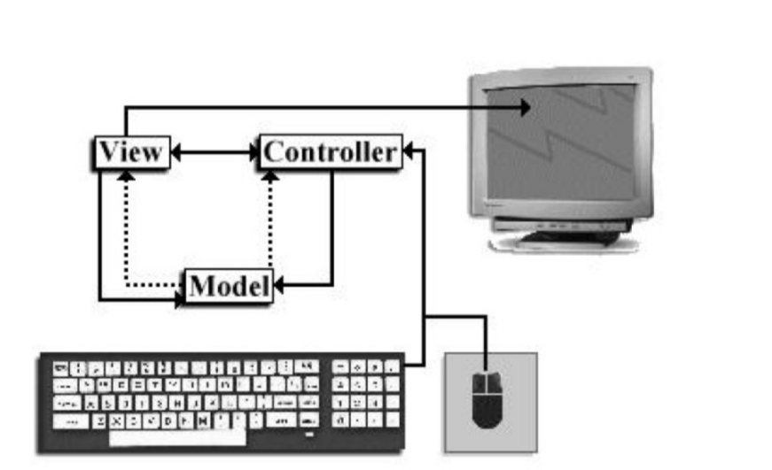

# Отчет по лабораторной работе №1
## Содержание:
1. [Архитектура MVC](#архитектура-mvc)
2. [Анализ кода](#анализ-кода)
3. [Заключение](#заключение)

# Архитектура MVC
Архитектура, предназначенная для создания легко расширяемых и
настраиваемых пользовательских интерфейсов называется архитектура **модель
– вид – контроллер** (Model/View/Controller, MVC). Эта архитектура остается одним из
самых удачных объектно-ориентированных решений, и поэтому часто
используется и сегодня.

### MVC состоит из трех частей.
- **Модель** (model) хранит данные компонента и позволяет легко, не
обращаясь к самому компоненту, изменять или получать эти данные. Например, раскрывающийся список позволяет вывести на экран перечень элементов
(обычно это строки). Вместо того чтобы включать методы для манипуляции
элементами списка в класс раскрывающегося списка, можно предоставить
отдельный класс, работающий исключительно с данными. Такой подход
позволит разработчику сосредоточиться именно на той задаче, которой он
занимается в данный момент: можно сначала подготовить данные (считать их из
файла или сетевого соединения, отсортировать, локализовать и т. п.), а потом
уже передать их раскрывающемуся списку для вывода на экран. Хранение
данных отдельно от самого компонента также позволяет изменять структуру
данных модели, не меняя функций компонента. Самое же главное состоит в том,
что отдельная модель позволяет появляться «хорошим» классам, которые
описывают данные в языке решаемой задачи, а не в языке той или иной
библиотеки пользовательского интерфейса. Если нам понадобится список книг
в библиотеке, мы назовем класс именно так, а не будем встраивать его в
мудреные классы, подгоняя под нужды интерфейса.
- **Вид** (view) выводит данные на экран для представления их пользователю.
Отделение вида от данных позволяет представлять одни и те же данные
совершенно разными способами. Например, текст формата HTML можно
вывести в разном виде: провести разметку документа, разместить изображения
и ссылки, использовать различные шрифты, а можно показать HTML-документ
как код, который состоит из набора тегов и текста среди них. Между тем данные
для этих разных видов требуются одни и те же (текст формата HTML).
Вспоминая пример с раскрывающимся списком, можно сказать, что он является
видом, представляющим на экране набор элементов. Данные раскрывающегося
списка можно было бы представить и в другом виде, например, в таблице.
- **Контроллер** (controller) определяет, как должны реагировать вид и данные
модели в ответ на действия пользователя. Наличие в MVC контроллера
позволяет использовать одни и те же данные и виды в разных целях. HTML-
страница, например, может быть показана в браузере или в визуальном средстве
создания страниц. Браузер может задействовать контроллер, который при
щелчке на ссылке переходит на страницу, указанную в ссылке (полностью
меняет данные модели, загружая в нее новую порцию HTML-текста), а
визуальное средство, скорее всего, использует контроллер, вызывающий при
щелчке на ссылке редактор свойств этой ссылки (который меняет лишь часть
данных модели, относящихся к ссылке). Раскрывающемуся списку также не
помешает пара контроллеров: один для списка, не позволяющего
редактирование элементов, а другой для редактируемого списка. Не всегда, но,
тем не менее, довольно часто, контроллер также выполняет надзирательные
функции и не позволяет пользователям портить модели некорректными
данными, проводя проверку их на правильность перед отсылкой в модель.

# Анализ кода

1. **Student(Model)**

#### Описание:
Класс `Student` содержит два приватных поля:
- `rollNo` (номер студента),
- `name` (имя студента).

К ним предоставлены методы доступа (геттеры и сеттеры):
- `getRollNo()` и `setRollNo()` — для работы с номером студента.
- `getName()` и `setName()` — для работы с именем студента.

#### Вывод:
Класс инкапсулирует данные, защищая их от прямого доступа, предоставляя безопасные методы для их изменения и получения. Это стандартный подход к созданию объектов в Java, обеспечивающий безопасность и контроль над изменением данных.

2. **StudentView**

#### Описание:
Класс `StudentView` предоставляет метод `printStudentDetailsInTable`, который выводит список студентов в таблицу с использованием `JTable` в графическом интерфейсе Java (`Swing`). Таблица отображает индекс студента, его имя и номер (Roll Number).

#### Основные элементы:
1. **Метод `printStudentDetailsInTable`**:
    - Принимает список объектов `Student` как параметр.
    - Внутри метода создан вложенный класс `InfoTable`, который реализует создание окна (`JFrame`) и отображение таблицы.

2. **Класс `InfoTable`**:
    - Инициализирует окно с таблицей, используя `JTable` для отображения данных.
    - Столбцы таблицы: "Index", "Name", "Roll Number".
    - Заполняет таблицу данными из переданного списка студентов (`model`).
    - Использует `JScrollPane` для прокрутки таблицы, если данных много.

3. **Отображение окна**:
    - Размер окна установлен на 500x200 пикселей.
    - Таблица отображается сразу после создания объекта `InfoTable`.

#### Вывод:
Класс `StudentView` предоставляет функциональность для отображения информации о студентах в графическом интерфейсе. Он инкапсулирует логику работы с GUI и упрощает визуализацию данных, что удобно при работе с пользовательским интерфейсом.

3. **StudentController**

#### Описание:
Класс `StudentController` также реализует паттерн MVC (Model-View-Controller), контролируя взаимодействие между моделью данных (**Student**) и представлением (**StudentView**). Контроллер управляет обновлением и отображением данных.

#### Основные элементы:
1. **Поля класса**:
    - `model`: список объектов `Student`, который представляет модель данных (информация о студентах).
    - `view`: объект `StudentView`, который отвечает за отображение данных.

2. **Конструктор**:
    - Принимает список студентов (`model`) и объект представления (`view`), устанавливая их для дальнейшего использования в контроллере.

3. **Методы доступа**:
    - `getModel()` и `setModel()`: позволяют получить или изменить модель данных.
    - `getView()` и `setView()`: позволяют получить или изменить объект представления.

4. **Метод `updateView()`**:
    - Вызывает метод `printStudentDetailsInTable()` у объекта `StudentView`, передавая список студентов для отображения их данных в графическом интерфейсе.

#### Вывод:
Класс `StudentController` связывает модель данных и представление, позволяя динамически обновлять и выводить информацию. Он упрощает управление процессом отображения данных, делая архитектуру приложения более модульной и гибкой.

4. **MVCPatternDemo(Демонстрация)**

#### Описание:
Класс `MVCPatternDemo` реализует демонстрацию паттерна проектирования MVC (Model-View-Controller) с использованием классов `Student`, `StudentView`, и `StudentController`. Он моделирует взаимодействие между моделью (данные о студентах), представлением (графический интерфейс для отображения данных), и контроллером (управление взаимодействием).

#### Основные элементы:
1. **Главный метод `main`**:
    - Инициализируется список студентов через метод `retrieveStudentFromDatabase0()`.
    - Создается объект представления (`StudentView`).
    - Создается контроллер (`StudentController`), который связывает модель и представление.
    - Вызывается метод `updateView()`, чтобы отобразить данные студентов.

   После этого:
    - Обновляется модель данными через метод `retrieveStudentFromDatabase1()`.
    - Контроллер снова обновляет представление с новыми данными.

2. **Методы `retrieveStudentFromDatabase0` и `retrieveStudentFromDatabase1`**:
    - Эти методы имитируют получение данных из базы данных.
    - `retrieveStudentFromDatabase0()` создает список из 100 студентов.
    - `retrieveStudentFromDatabase1()` создает список из 50 студентов, чтобы продемонстрировать обновление модели и представления.

#### Вывод:
Класс `MVCPatternDemo` демонстрирует работу паттерна MVC на примере данных о студентах. Он разделяет ответственность между тремя компонентами: модель отвечает за хранение данных, представление — за их отображение, а контроллер — за управление взаимодействием между ними. Этот подход улучшает гибкость и поддержку приложения, упрощая обновление и масштабирование кода.

# Заключение:
### Общий вывод по лабораторной работе

Данная лабораторная работа демонстрирует реализацию паттерна проектирования **MVC (Model-View-Controller)** на примере управления данными студентов. Паттерн разделяет логику приложения на три компонента — модель, представление и контроллер, что способствует более организованной и структурированной разработке.

#### Основные результаты:
1. **Модель (`Student`)**:
    - Инкапсулирует данные о студентах, предоставляя механизмы для работы с ними через геттеры и сеттеры. Это обеспечивает безопасность данных и контроль над их изменением.

2. **Представление (`StudentView`)**:
    - Использует графический интерфейс Java (Swing) для отображения данных в таблице, делая их визуализацию удобной для пользователя. Таблица представляет студентов по их имени и номеру.

3. **Контроллер (`StudentController`)**:
    - Связывает модель с представлением, управляет обновлением и отображением данных. Контроллер позволяет легко изменять модель и мгновенно передавать изменения в представление.

4. **Запуск (`MVCPatternDemo`)**:
    - Демонстрирует практическое применение паттерна MVC. В приложении происходит инициализация данных, их обновление и повторное отображение, что показывает гибкость и удобство использования MVC-архитектуры.

#### Вывод:
Паттерн **MVC** улучшает модульность и масштабируемость приложений, отделяя логику работы с данными от логики их отображения. В лабораторной работе MVC продемонстрировал свою эффективность, позволив динамически обновлять данные и легко управлять представлением. Этот подход упрощает дальнейшее развитие, поддержку и модификацию приложения.